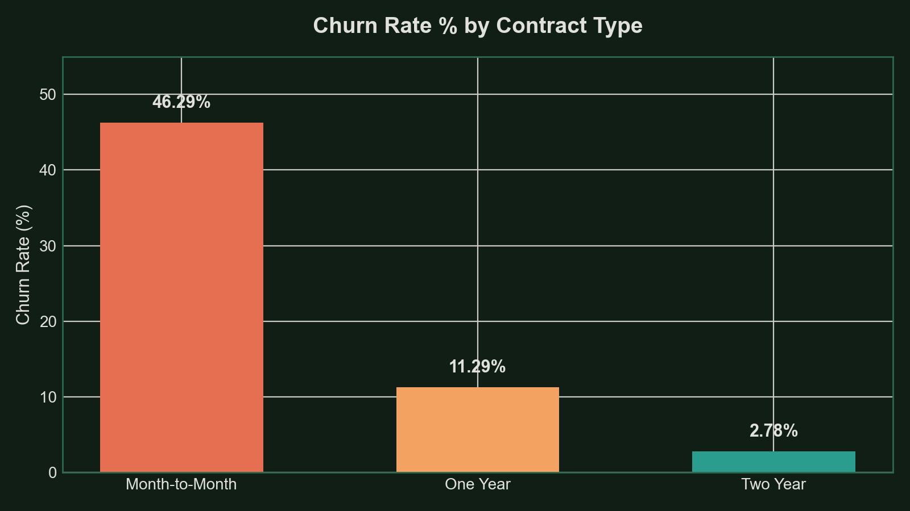
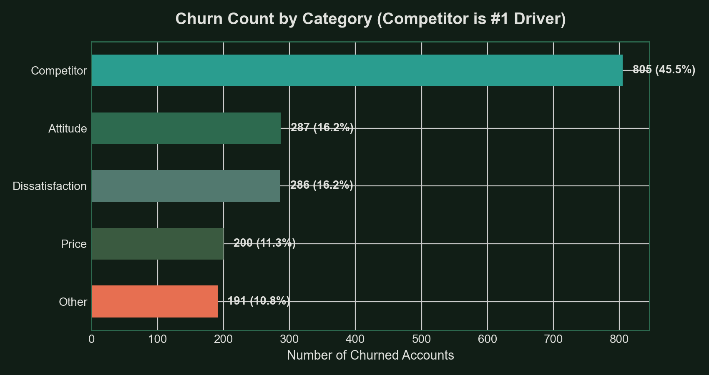

# 📊 Telecom Customer Churn Analysis — Databel Dataset

---

## 📌 Executive Summary

This project presents an exploratory data analysis (EDA), risk segmentation, and root-cause analysis on **Databel's telecom dataset** containing **6,687 customer accounts**. The primary objective was to uncover key drivers of customer attrition, isolate high-risk subscriber segments, and evaluate financial/demographic churn indicators using **Microsoft Excel**.

> 💡 **Core Finding:** Databel suffers from a **26.86% baseline churn rate** (1,796 lost accounts out of 6,687). **Month-to-Month contract holders** experience a staggering **46.29% churn rate**, while **Competitor Offers & Promotions** account for **~45% of total customer attrition**.

---

## 📊 Visual Insights & Key Analytics

### 1. Risk Segmentation by Contract Type
Month-to-Month contract subscribers are **16.6x more likely to churn** than customers on 2-Year contracts.

  

| Contract Type | Total Customers | Churned Accounts | Churn Rate (%) | Risk Level |
| :--- | :---: | :---: | :---: | :---: |
| **Month-to-Month** | 3,411 | 1,579 | **46.29%** | 🚨 **High Risk** |
| **One Year** | 1,479 | 167 | **11.29%** | ⚠️ **Moderate** |
| **Two Year** | 1,797 | 50 | **2.78%** | ✅ **Low Risk / High Retention** |

---

### 2. Primary Churn Drivers & Catalysts
Analyzing reasons for customer departures revealed that **Competitor Offers** (better devices, data deals, pricing) drive nearly half of all churned accounts.

  

| Churn Category | Churned Accounts | % of Total Churn | Key Business Takeaway |
| :--- | :---: | :---: | :--- |
| **Competitor** | **805** | **44.82%** | Aggressive competitor promotions & device deals are poaching customers. |
| **Attitude** | 287 | 15.98% | Service attitude and support experience issues. |
| **Dissatisfaction**| 286 | 15.92% | Product or network dissatisfaction. |
| **Price** | 200 | 11.14% | Price sensitivity and extra charges. |
| **Other** | 191 | 10.63% | Relocation, death, or personal reasons. |

---

## 🛠️ Data Wrangling & Excel Methodology

The analysis was performed across **5 structured workbook sheets** in `Analyzing_Customer_Churn.xlsx`:

1. **`Overview`:** High-level executive KPI scorecard.
2. **`Churn Analysis`:** Contract level breakdowns and churn rate formulas.
3. **`Customer Pivots`:** Dynamic Pivot Tables aggregating support call frequencies, extra data charges, and international plan fees.
4. **`Databel - Aggregate`:** Grouped consumption tiers (`Grouped Consumption` e.g., `< 5 GB`) and demographic metrics.
5. **`Databel - Customer`:** Master granular dataset with engineered feature flags.

### Key Excel Formulas & Feature Engineering Applied:
- **Demographic Flags:** `Under 30` and `Senior` binary flags.
- **Numeric Churn Indicator:** `Churn` (1 = Churned, 0 = Active) for pivot calculations.
- **Consumption Tiers:** `Grouped Consumption` bucketing download data usage.
- **Pivot Tables & Summary Formulas:** `SUMIFS`, `AVERAGEIFS`, `XLOOKUP`, and dynamic Pivot Charts.

---

## 🎯 Business Recommendations

1. **Incentivize Long-Term Contracts:** Offer small bill discounts or device upgrade credits to convert Month-to-Month users (46.29% churn) into 1-Year or 2-Year contracts.
2. **Counter Competitor Promotions:** Launch targeted competitive matching promotions for users approaching contract renewal or inquiring about international data plans.
3. **Early Support Call Intervention:** Proactively reach out to accounts making >3 customer service calls to resolve issues before churn occurs.

---

## 📥 Download Excel File

You can inspect the full interactive Excel workbook directly in this repository:
- 📄 **[Download Analyzing_Customer_Churn.xlsx](Analyzing_Customer_Churn.xlsx)**